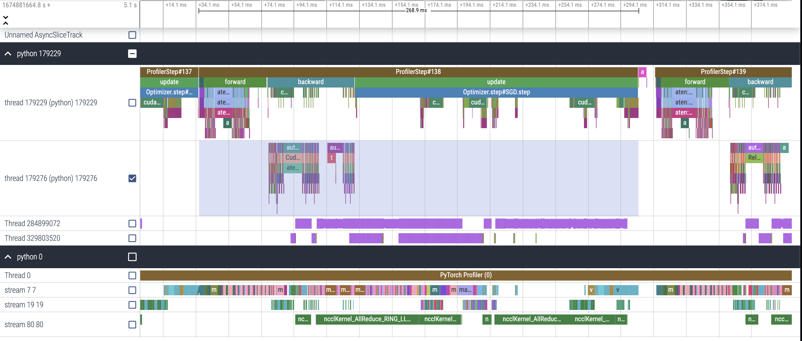
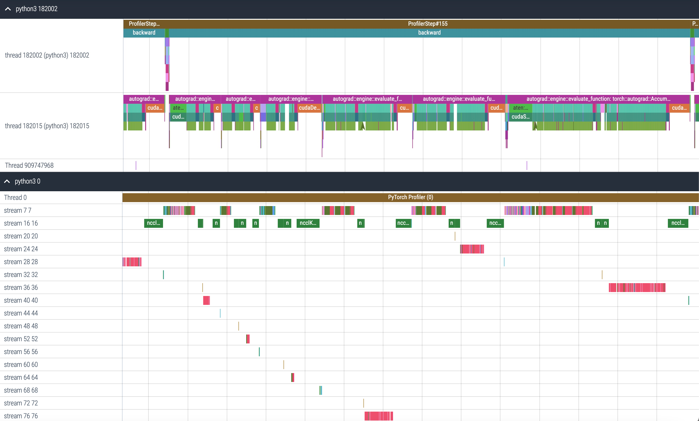

# Overlapping Profiling Results

We evaluate the capability to overlap gradient compression, DNN computation and gradient communication of HiPress and TorchDDP to demonstrate the ideal pipeline we discuss in Figure 8 of our paper.

We use 2 nodes to train a vgg19 network, each with one 1080Ti, interconnected with 1000Mbps network.

## HiPress

The following screenshot shows the profiling result of HiPress atop PyTorch with PowerSGD(rank = 64). The profiling file can be found in `profiling_results/hipress_2n2c_rank64.json`.

As we can see in section "python 0", Stream 7 is for DNN computation (forward and backward), Stream 19 is for gradient compression, and Stream 80 is for gradient communication. Gradient compression is overlapping with DNN computation, and as soon as gradient communication is finished, HiPress starts gradient communication immediately.

The overlapping is enabled by our task manager we implemented in HiPress.

Due to the overlapping, our training step time in this case is **273.55ms** in average. The training log of step time can be found in `step_time/hipress_2n2c_rank64.txt`.

You can reproduce the profiling file by running the script in `scripts/hipress/run_2n2c_rank64_profile.sh`, and the step time by running `scripts/hipress/run_2n2c_rank64.sh`. You should adjust the ip address according to your cluster and put `hipress_powersgd_vgg.py` in the right directory (/workspace in my case) before using the script.

## TorchDDP

The following screenshot shows the profiling results of TorchDDP with PowerSGD(rank = 64). The profiling file can be found in `profiling_results/torchddp_2n2c_rank64.json`.

Stream 7 is for DNN computation, Stream 16 is for gradient communication, Stream 20, 24, 28, 32, 36,40, 44, 48, 52, 56, 60, 64, 68, 72, 76 are for gradient compression. These streams are not overlapped, causing a great increase in training step time, which is **794.01ms** in average. The training log of step time can be found in `step_time/torchddp_2n2c_rank64.txt`.

Since TorchDDP implemented gradient compression in hook and it lacked dependency tracking ability, gradient communication and gradient compression, as well as DNN computation, cannot overlap.

You can reproduce the profiling file by running `scripts/torchddp/run_2n2c_rank64_profile.sh`, and the step time by running `scripts/torchddp/run_2n2c_rank64.sh`. You should adjust the ip address according to your cluster and put `torchddp_powersgd_vgg.py` in the right directory (/workspace in my case) before using the script.